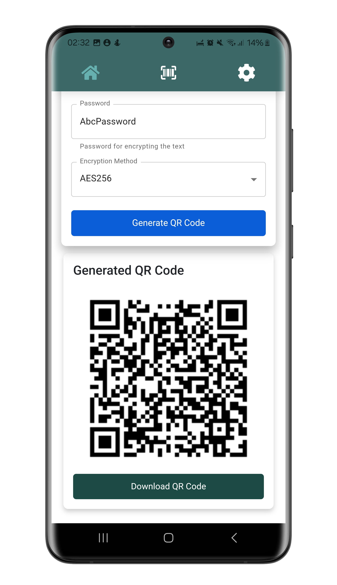
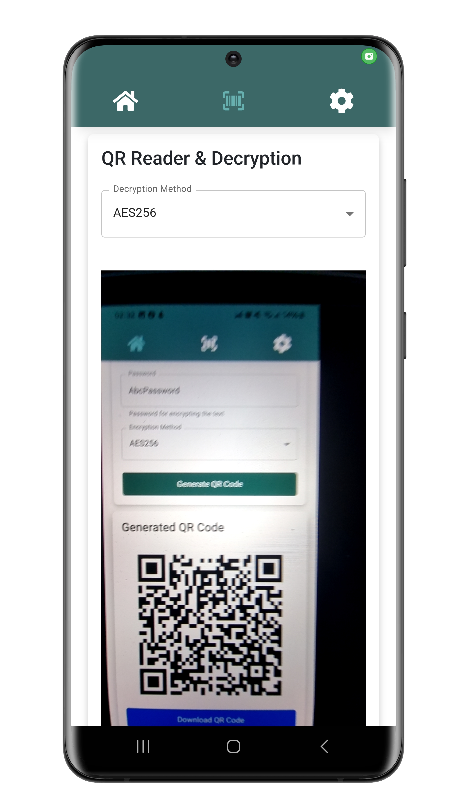
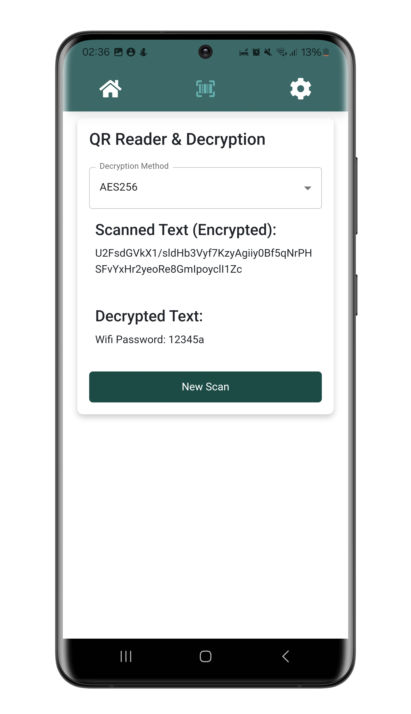

# Secure QR
Last Edit: 12.2024 <br>
Language: Typescript React Capacitor with Vite<br>


Secure QR is a practical application for encrypting texts such as passwords and generating a QR code. This can then be decrypted again using the app.

Deutsche Kurzbeschreibung: Secure QR ist eine praktische Anwendung um Texte wie Passwörter zu verschlüsseln und einen QR Code zu generieren. Dieser lässt sich anschließend mit der App wieder entschlüsseln.

## App Store Screens

| Start Screen                                                            | Generated QR Code                                                                        | QR Scanner                                                                     | QR Scan Result                                                         |
| ----------------------------------------------------------------------- | ------------------------------------------------------------------------------------------ | ---------------------------------------------------------------------------------- | ----------------------------------------------------------------- |
|  |  |  |  |

## Architecture

The components used are divided into four categories:

- `UI-Elements`
- `View-Componets`
- `Container-Componets`
- `ServiceLayer`

Note: Some of the modules are used from other Web Apps from me like the UsedLibs Modul or the Impressum/Imprint Modules.
As a result of the use from the modules there is also one configuration file:

- `app_texts`: Contains texts such as the description, imprint text, data protection text etc.

In addition, the separation is not 100% sharp, partly because of these modules, but also because the final architecture only turned out that way during development.

`UI-Elements`
At the topmost level, UI-Elements are the fundamental building blocks of our interface. These are the atomic components that include buttons, input fields, and other basic interactive elements. They are styled and abstracted to be reusable across the application.
Examples of this are the drop down menu, input fields, the cards, qr code scanner, etc.

`View-Components`
View-Components are composed of UI-Elements and form parts of the application's screens. They are responsible for presenting data and handling user interactions. These components are often reusable within different parts of the application and can communicate with Container-Components for dynamic data fetching.

`Container-Components`
Container-Components serve as the data-fetching and state management layer in our architecture. They connect View-Components to the Service Layer, managing the application state and providing data to the components as necessary. They may also handle complex user interactions, form submissions, and communicate with services to send or receive data.

`Service Layer`
The Service Layer is the foundation of our application's client-side architecture. 
There is a separate encapsulated service which is responsible for the logging while the development or the encryption service which uses crpyto js. The generic helper methods / hooks also belong there, such as the methods for an transparent status bar or the hook that allows you to swipe through the app.

## Available Scripts

In the project directory, you can run:

### `npm run dev`
Runs the app in the development mode.
Open [http://localhost:5173](http://localhost:5173) to view it in the browser.

### `npm run build`

Builds the app for production to the `build` folder.\
It correctly bundles React in production mode and optimizes the build for the best performance.

The build is minified and the filenames include the hashes.\
Your app is ready to be deployed!

### `npx license-checker --json --production --out licenses.json`
Generate the JSON with the licenses of the NPM packages used. This can then replace the existing license json under /legal/usedLibs.


## Expanding the ESLint configuration

If you are developing a production application, we recommend updating the configuration to enable type aware lint rules:

- Configure the top-level `parserOptions` property like this:

```js
export default tseslint.config({
  languageOptions: {
    // other options...
    parserOptions: {
      project: ['./tsconfig.node.json', './tsconfig.app.json'],
      tsconfigRootDir: import.meta.dirname,
    },
  },
})
```

- Replace `tseslint.configs.recommended` to `tseslint.configs.recommendedTypeChecked` or `tseslint.configs.strictTypeChecked`
- Optionally add `...tseslint.configs.stylisticTypeChecked`
- Install [eslint-plugin-react](https://github.com/jsx-eslint/eslint-plugin-react) and update the config:

```js
// eslint.config.js
import react from 'eslint-plugin-react'

export default tseslint.config({
  // Set the react version
  settings: { react: { version: '18.3' } },
  plugins: {
    // Add the react plugin
    react,
  },
  rules: {
    // other rules...
    // Enable its recommended rules
    ...react.configs.recommended.rules,
    ...react.configs['jsx-runtime'].rules,
  },
})
```
# Used NPM Modules
According to the command npm list You can see the deeper NPM modules used and which of these are used in the licenses.json.

├── @capacitor/android@6.2.0

├── @capacitor/cli@6.2.0

├── @capacitor/core@6.2.0

├── @capacitor/ios@6.2.0

├── @capacitor/status-bar@6.0.2

├── @emotion/react@11.14.0

├── @emotion/styled@11.14.0

├── @eslint/js@9.16.0

├── @mui/icons-material@6.1.10

├── @mui/material@6.1.10

├── @testing-library/jest-dom@6.6.3

├── @testing-library/react@16.1.0

├── @types/crypto-js@4.2.2

├── @types/jest@29.5.14

├── @types/qrcode@1.5.5

├── @types/react-dom@18.3.2

├── @types/react-swipeable@5.2.0

├── @types/react@18.3.14

├── @vitejs/plugin-react@4.3.4

├── bootstrap@5.3.3

├── crypto-js@4.2.0

├── eslint-plugin-react-hooks@5.1.0

├── eslint-plugin-react-refresh@0.4.16

├── eslint@9.16.0

├── globals@15.13.0

├── i18next-browser-languagedetector@8.0.2

├── i18next@24.0.5

├── install@0.13.0

├── jest@29.7.0

├── npm@10.9.2

├── qr-scanner@1.4.2

├── qrcode@1.5.4

├── react-bootstrap@2.10.6

├── react-dom@18.3.1

├── react-i18next@15.1.3

├── react-icons@5.4.0

├── react-qr-scanner@1.0.0-alpha.11

├── react-router-dom@7.0.2

├── react-swipeable@7.0.2

├── react@18.3.1

├── typescript-eslint@8.17.0

├── typescript@5.6.3

└── vite@6.0.3